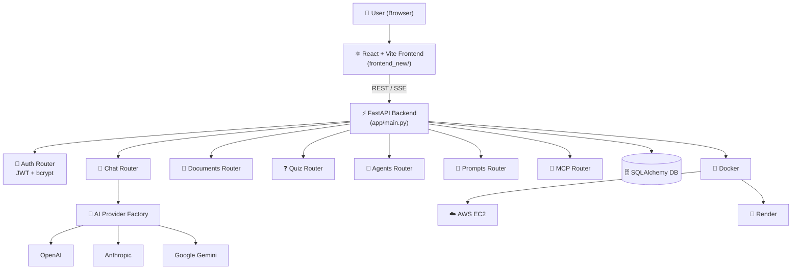

# IBM_AI-WORK-SPACE
# StudyMate AI 🎓

> **Your Personal AI Learning Assistant**

An AI-powered web application built for the **IBM Internship — Vibe Coding Masterclass 2026**.
StudyMate AI helps students learn faster with instant tutoring, document Q&A, summaries, quizzes, and study tools — powered by a pluggable AI provider layer (OpenAI / Anthropic / Gemini) with a FastAPI backend and a React + TypeScript frontend.

[](https://fastapi.tiangolo.com)
[](https://python.org)
[](https://react.dev)
[](https://vitejs.dev)
[](https://docker.com)
[](https://aws.amazon.com/ec2/)
[](https://render.com)

---

## 🌐 Live Deployment

| Environment | URL | Notes |
|---|---|---|
| ☁️ **AWS EC2** | [http://13.236.183.122:8000](http://13.236.183.122:8000) | Backend running on an EC2 instance |
| 🚀 **Render** | [https://studymate-ai-latest.onrender.com](https://studymate-ai-latest.onrender.com) | Auto-deployed from this repository |

> ⚠️ Free-tier Render services spin down when idle — the first request after inactivity may take up to a minute to respond.

---

## ✨ Features

| Feature | Description |
|---|---|
| 💬 **AI Tutor / Chat** | Ask any academic question — get structured, detailed explanations with examples |
| 📄 **Document Q&A** | Upload PDFs / docs / images and ask questions grounded in their content |
| ❓ **Quiz Generator** | Auto-generate MCQs with options, correct answers, and explanations |
| 🧩 **Agents Hub** | Task-specific AI agents for different study workflows |
| 🖼️ **Image & CSV Tools** | Analyze images and tabular data through dedicated pages |
| 🔑 **Auth** | JWT-based registration/login with secure password hashing |
| ⚡ **Streaming Responses** | Real-time streaming replies in the chat UI |
| 🌙 **Modern UI** | Dark, animated React interface (Tailwind, Framer Motion, Three.js) |
| 📱 **Responsive** | Works across desktop, tablet, and mobile |

---

## 🏗️ Architecture



---

## 📁 Project Structure

```
studymate-ai/
├── app/                          # FastAPI backend
│   ├── main.py                   # App entry point, CORS, lifespan, routers
│   ├── config.py                 # Settings (pydantic-settings)
│   ├── database.py               # SQLAlchemy engine/session
│   ├── ai/                       # Pluggable AI provider layer
│   │   ├── factory.py            # Provider factory (OpenAI/Anthropic/Gemini/HF)
│   │   ├── openai_provider.py
│   │   ├── anthropic_provider.py
│   │   ├── gemini_provider.py
│   │   └── huggingface_provider.py
│   ├── auth/                     # JWT auth (security, dependencies)
│   ├── models/                   # SQLAlchemy models (user, document, prompt, conversation, mcp)
│   ├── routers/                  # API route modules (auth, chat, documents, quiz, agents, prompts, mcp)
│   └── services/                 # Document processing, encryption
│
├── frontend_new/                 # React + TypeScript + Vite frontend
│   ├── src/pages/                 # Chat, Documents, Quiz, Agents, CSV, Image, Resume, Settings, etc.
│   ├── src/components/            # Layout + UI components
│   ├── src/stores/                # Zustand stores (auth, chat)
│   └── src/lib/                   # API client, utils
│
├── docker/                       # Dockerfiles for backend & frontend + nginx config
├── docker-compose.yml            # Multi-service local orchestration
├── scripts/                      # Utility & report-generation scripts
├── requirements.txt              # Python dependencies
├── .env.example                  # Environment variable template (copy to .env)
├── .gitignore
└── README.md                     # This file
```

---

## 🚀 Quick Start (Local Development)

### Prerequisites
- Python 3.11+
- Node.js 18+ (for the frontend)
- An API key for at least one AI provider (OpenAI, Anthropic, or Google Gemini)

### 1. Clone the Project

```bash
git clone https://github.com/PONNADIAN/IBM_AI-WORK-SPACE.git
cd IBM_AI-WORK-SPACE/studymate-ai
```

### 2. Backend Setup

```bash
python -m venv venv

# Windows
.\venv\Scripts\Activate
# Mac/Linux
source venv/bin/activate

pip install -r requirements.txt

cp .env.example .env      # then edit .env and add your API key(s)

uvicorn app.main:app --reload --port 8000
```

Backend runs at **http://localhost:8000** (Swagger docs at `/docs`).

### 3. Frontend Setup

```bash
cd frontend_new
npm install
npm run dev
```

Frontend runs at **http://localhost:5173**.

---

## 🔧 Environment Variables

| Variable | Description | Default |
|---|---|---|
| `AI_PROVIDER` | Active provider: `openai` / `anthropic` / `gemini` | `gemini` |
| `AI_MODEL` | Model name for the active provider | *(provider default)* |
| `OPENAI_API_KEY` | OpenAI API key | *(none)* |
| `ANTHROPIC_API_KEY` | Anthropic API key | *(none)* |
| `GOOGLE_API_KEY` | Google Gemini API key | *(none)* |
| `SECRET_KEY` | JWT signing secret | *(none — set your own)* |
| `DATABASE_URL` | SQLAlchemy database URL | `sqlite:///./ai_workspace.db` |
| `ALLOWED_ORIGINS` | CORS origins (JSON array) | `["http://localhost:5173"]` |
| `UPLOAD_DIR` | Directory for uploaded files | `uploads` |

> 🔒 Never commit your real `.env` file. Use `.env.example` as the template — `.env` is already excluded via `.gitignore`.

---

## 🐳 Docker

```bash
# Build and run the backend
docker build -f docker/Dockerfile.backend -t studymate-ai-backend .
docker run -p 8000:8000 --env-file .env studymate-ai-backend

# Or run the full stack
docker compose up --build
```

---

## ☁️ Deployment

### AWS EC2 — [http://13.236.183.122:8000](http://13.236.183.122:8000)
The backend is containerized with Docker and deployed on an AWS EC2 instance, exposed on port `8000` with environment variables configured for the production AI provider and secrets.

### Render — [https://studymate-ai-latest.onrender.com](https://studymate-ai-latest.onrender.com)
Deployed on [Render](https://render.com) as a web service built directly from this repository's Docker configuration, with environment variables set in the Render dashboard.

---

## 🛠️ Tech Stack

| Layer | Technology |
|---|---|
| **Frontend** | React 19, TypeScript, Vite, Tailwind CSS, Radix UI, Zustand, React Query |
| **3D / Animation** | Three.js, @react-three/fiber, Framer Motion |
| **Backend** | Python 3.11, FastAPI, Uvicorn, SQLAlchemy |
| **Auth** | JWT (python-jose), bcrypt (passlib) |
| **AI Providers** | OpenAI, Anthropic, Google Gemini (pluggable factory pattern) |
| **Document Processing** | PyMuPDF, python-docx, pandas, openpyxl, Pillow |
| **Containerization** | Docker, Docker Compose |
| **Deployment** | AWS EC2, Render |
| **Version Control** | Git + GitHub |

---

## 🔮 Future Scope

- Multi-language support
- Voice input / text-to-speech
- Export flashcards to Anki format
- Performance analytics dashboard
- CI/CD pipeline for automated deploys to EC2 and Render

---

*Built with ❤️ for the IBM Internship — Vibe Coding Masterclass, 2026*
